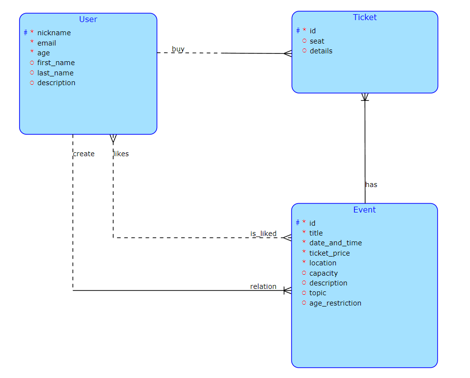

# Event explorer
## 1. Brief description of the project
The goal of the project is to create a service for buying tickets to various events. The user can create their own events and buy tickets to other people's events.
## 2. System description
The system consists of the following basic parts:

1. User registration and authorization
2. Buy tickets
3. Creating events 
4. Delete Users and Events
### 2.1 User registration and authorization
---
Before using the service you need to create or log in to your account. After successful registration/authorization access to the service is opened.
#### 2.1.1 Registration
---
To register you need to give yourself a nickname and password, specify your age and email.
#### 2.1.2 Authorization
---
When authorizing, you need to provide your email and password.
### 2.2 Buying tickets
---
Buying a ticket is allowed under certain conditions:

- there are free seats left for the event
- If the age limit is specified, the user must meet it.

If all conditions are met, the user can buy a ticket. It will be possible to choose the number of tickets, as well as the seat.

After buying a ticket, it will be displayed in a separate tab.
### 2.3 Creating Events
---
When creating an event, you need to specify the name, date and time of the event, ticket price and location. You can add optional parameters, such as: number of seats, description, theme of the event. 

Own events are displayed in a separate tab. You can see who bought tickets, how many seats are left and how much money was collected.
### 2.4 Delete Users and Events
---
A user can always delete their account or the events they own.

## 3. Conceptual model of the database

## 4. Complex request on the server side
When viewing an event, you can see a list of other events that have more likes than this event.
## 5. Client-side business operation: Ticket purchase with improved availability control

### 5.1 Description
---
This optimized process is designed for convenient purchase of tickets for various events. When a customer clicks the "Buy Ticket" button, the system automatically checks the availability of seats. If seats are available, the ticket purchase process continues successfully; otherwise, the customer is informed that tickets are not available.

### 5.2 Steps
---
1. The customer selects an event, enters the required information and clicks the "Buy Ticket" button.
2. After this action, the system instantly checks the current availability of the selected event.
3. If tickets are available, the ticket purchase is successfully completed.
4. If all tickets are already sold out, the system informs the customer.
